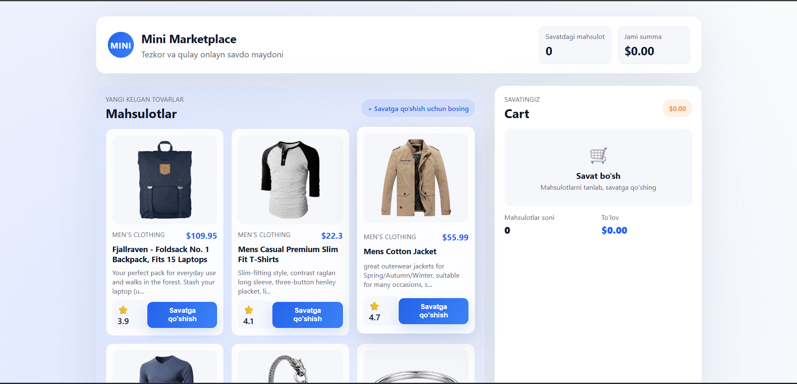
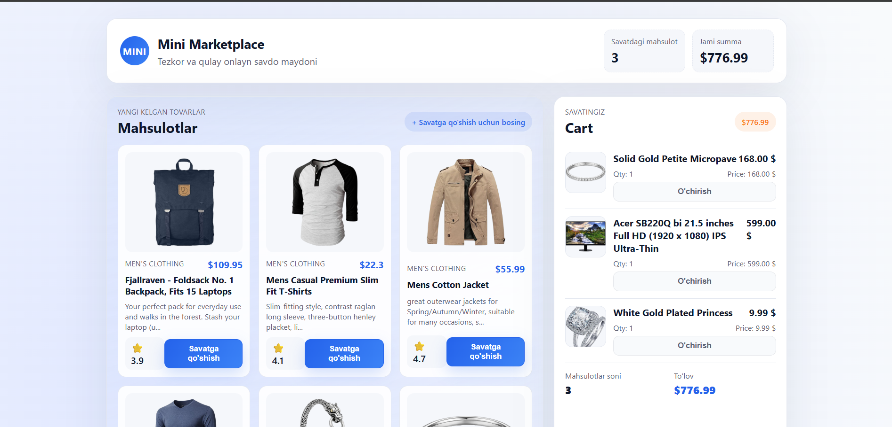

# Mini Marketplace

Qulay, zamonaviy mini marketplace UI. Mahsulotlar `fakestoreapi.com` orqali olinadi va `localStorage` orqali savatcha saqlanadi.

## Loyiha haqida
- Vite + React (HMR yoqilgan)
- Vanilla JS mahsulot ro'yxati (`src/products-vanilla.js`)
- Savat holati React ichida yuritiladi va `localStorage`ga saqlanadi

## Ishga tushirish
```bash
npm install
npm run dev
```
Brauzerda ko'rsatilgan localhost portini oching.

## Hisobot
- Ism: Asilbek Suvonov Baxtiyor o'g'li
- Vazifa qancha vaqt oldi: 1.5 soat
- Qiyin bo'lgan joylar: qiyin bulgani yuq
- Interfeys skrinshotlari:
  - 
  - 
- Demo havolasi (agar bo'lsa): 
  ```https://mini-marketplace-omega.vercel.app/```

## Foydali joylar
- Asosiy komponent: `src/App.jsx`
- Savat komponentlari: `src/cart/CartList.jsx`, `src/cart/CartItem.jsx`
- Stil fayli: `src/styles.css`
- Mahsulotni chaqirish va render: `src/products-vanilla.js`
